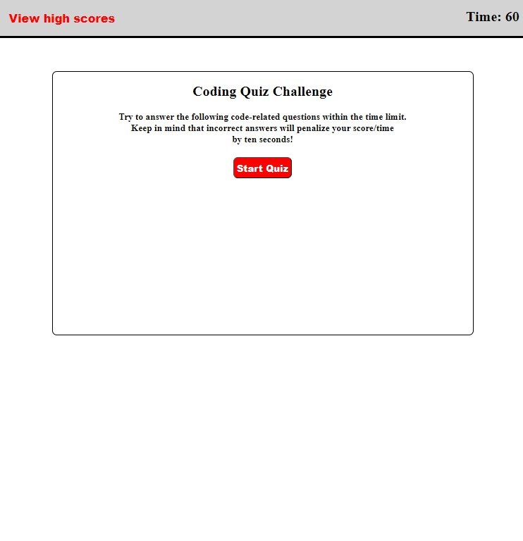

# Examination#

## Description

This app was focused on building from scratch. Which was using HTML, CSS and Javascript. The HTML and CSS are used to design the page with style. The Javascript used in this assignment was to get the page responsive when clicking on an item. Another item like wrong answer, correct answer, saving your initials at the end of the quiz will generate. The quiz is fully accessable with no issues so that you may continue to the end.

## Installation

There are no installations for this assignment. Used "Git" to push assignment to my github repo.

Steps: git status, git add . , git commit -m "message", git push origin main
I also had to use "git stash" to get my original repo from github since I messed my work up which came in handy. So, that I didn't have to redo the whole assignment.

## Usage

## Links

[deployed site](https://lexxvasquez.github.io/Examination)

[Github](https://github.com/Lexxvasquez/Examination)
